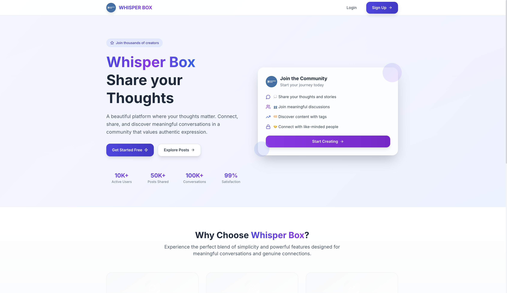
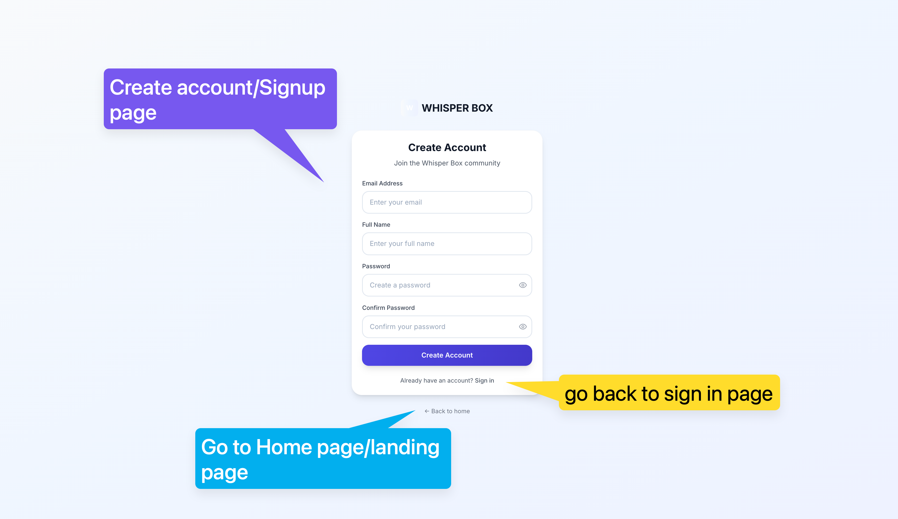
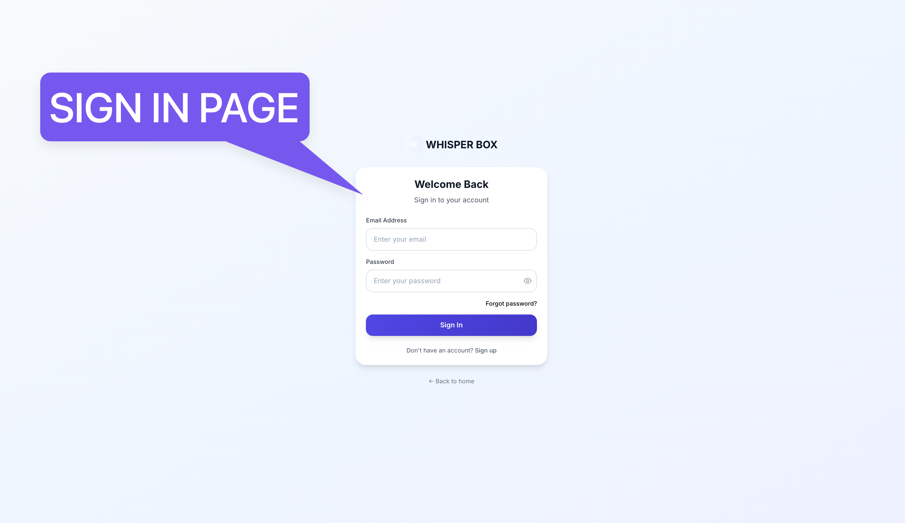
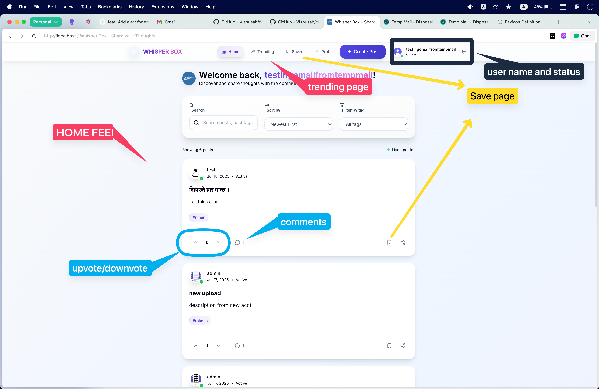
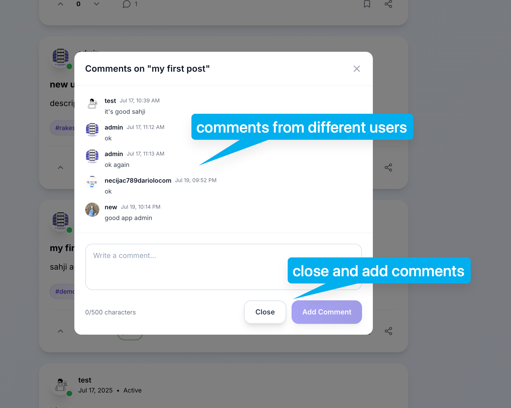
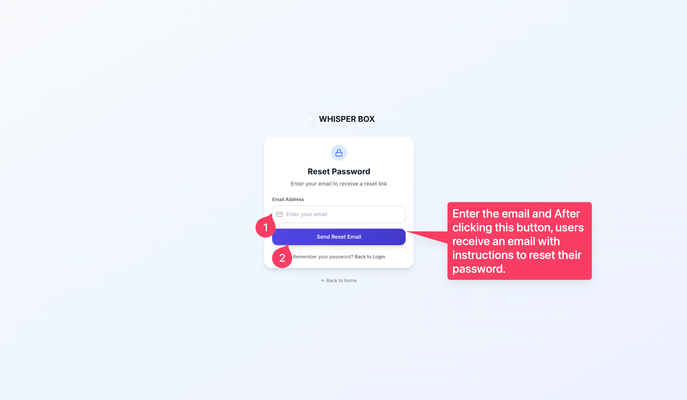
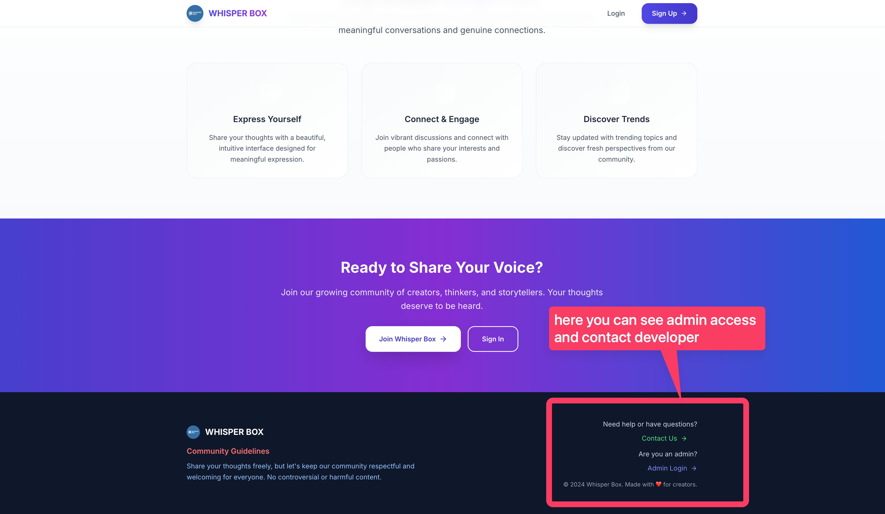

# WHISPER BOX 📝

**A Modern Social Media Platform for Anonymous Sharing**

*3rd Semester College Project*  
**Softwarica College of IT and E-commerce, Dillibazar**

---

## 👥 Team Members

- **Kamlesh Kumar Sah** -  bankend developer & UX Designer
- **Sabja Shrestha** - Frontend Developer & UI/UX Designer  
- **Nihar Regmi** - Project Lead & Decumentation 
- **Sarjak** - comming soon 

---

## 📖 About The Project

Whisper Box is a modern social media platform that allows users to share their thoughts, ideas, and experiences in a safe and welcoming environment. Built with React and Node.js, this platform focuses on community engagement while maintaining user privacy and security.

### 🎯 Project Objectives

- Create a user-friendly social media platform
- Implement secure authentication and authorization
- Provide real-time interactions (posts, comments, voting)
- Ensure responsive design for all devices
- Maintain data security and user privacy

---

## ✨ Key Features

### 🔐 Authentication System
- **User Registration & Login**
- **Email Verification with OTP**
- **Password Reset Functionality**
- **Secure JWT Token Management**
- **Admin Panel Access**

### 📱 Core Functionality
- **Create and Share Posts** with images and hashtags
- **Interactive Voting System** (upvote/downvote)
- **Comment System** with real-time updates
- **Save Posts** for later viewing
- **Advanced Search & Filtering**
- **User Profile Management**

### 🛡️ Security Features
- **Email Verification** for account activation
- **Rate Limiting** to prevent spam
- **Input Validation** and sanitization
- **Secure File Upload** with size restrictions
- **Admin Controls** for user management

---

## 🖼️ Screenshots

### Landing Page

*Clean and modern landing page with clear call-to-action*

### User Registration

*Simple and intuitive registration process*

### User Login

*Secure login with email verification*

### Email Verification Process
[](/images/emailverification.mp4)

*Complete email verification workflow with OTP - Shows the entire process from registration to email confirmation*

### Homepage Dashboard

*Main dashboard showing posts with search and filter options*

### Comments System

*Interactive comment system for community engagement*

### Password Reset

*Secure password reset functionality*

### Footer

*Professional footer with contact information and guidelines*

---

## 🛠️ Technology Stack

### Frontend
- **React 18** - Modern UI framework
- **React Router DOM** - Client-side routing
- **Tailwind CSS** - Utility-first CSS framework
- **Lucide React** - Beautiful icon library
- **Vite** - Fast build tool and development server

### Backend
- **Node.js** - JavaScript runtime
- **Express.js** - Web application framework
- **PostgreSQL** - Relational database
- **Sequelize** - ORM for database management
- **JWT** - JSON Web Tokens for authentication

### Tools & Libraries
- **Multer** - File upload handling
- **Nodemailer** - Email service integration
- **bcrypt** - Password hashing
- **CORS** - Cross-origin resource sharing
- **Helmet** - Security middleware
- **Morgan** - HTTP request logger

---

## 📁 Project Structure

```
WHISPER_BOX/
├── backend/                 # Backend API server
│   ├── config/             # Database configuration
│   ├── controllers/        # Route controllers
│   ├── middleware/         # Custom middleware
│   ├── models/             # Database models
│   ├── routes/             # API routes
│   ├── services/           # Business logic
│   └── server.js           # Main server file
├── src/                    # Frontend source code
│   ├── components/         # Reusable components
│   ├── contexts/           # React contexts
│   ├── pages/              # Page components
│   ├── services/           # API services
│   └── utils/              # Utility functions
├── public/                 # Static assets
└── images/                 # Project screenshots
```

---

## 🚀 Getting Started

### Prerequisites
- Node.js (v16 or higher)
- PostgreSQL database
- npm or yarn package manager

### Installation

1. **Clone the repository**
   ```bash
   git clone https://github.com/Visnusah/WHISPER_BOX.git
   cd WHISPER_BOX
   ```

2. **Install Frontend Dependencies**
   ```bash
   npm install
   ```

3. **Install Backend Dependencies**
   ```bash
   cd backend
   npm install
   ```

4. **Set up Environment Variables**
   Create `.env` file in the backend directory:
   ```env
   DB_HOST=localhost
   DB_PORT=5432
   DB_NAME=whisper_box
   DB_USER=your_username
   DB_PASSWORD=your_password
   JWT_SECRET=your_jwt_secret
   EMAIL_USER=your_email@gmail.com
   EMAIL_PASS=your_app_password
   ```

5. **Set up Database**
   ```bash
   cd backend
   npm run setup-db
   ```

### Running the Application

1. **Start Backend Server**
   ```bash
   cd backend
   npm start
   ```

2. **Start Frontend Development Server**
   ```bash
   npm run dev
   ```

3. **Access the Application**
   - Frontend: `http://localhost:5173`
   - Backend API: `http://localhost:3000`

---

## 📧 Email Verification Demo

Watch our email verification system in action:

https://github.com/user-attachments/assets/your-video-id

*The video shows the complete OTP verification process from registration to email confirmation*

---

## 🔧 API Endpoints

### Authentication
- `POST /api/auth/register` - User registration
- `POST /api/auth/login` - User login
- `POST /api/auth/verify-email` - Email verification
- `POST /api/auth/forgot-password` - Password reset request
- `POST /api/auth/reset-password` - Password reset confirmation

### Posts
- `GET /api/posts` - Get all posts
- `POST /api/posts` - Create new post
- `PUT /api/posts/:id` - Update post
- `DELETE /api/posts/:id` - Delete post

### Comments & Voting
- `POST /api/comments` - Add comment
- `POST /api/votes` - Vote on post
- `GET /api/saved-posts` - Get saved posts

---

## 🎨 Design Highlights

- **Modern UI/UX** with clean and intuitive design
- **Responsive Layout** that works on all devices
- **Consistent Color Scheme** using Tailwind CSS
- **Smooth Animations** for better user experience
- **Professional Typography** for readability

---

## 🔒 Security Measures

- **Password Hashing** using bcrypt
- **JWT Token Authentication** for secure sessions
- **Input Validation** to prevent injection attacks
- **File Upload Security** with type and size restrictions
- **Rate Limiting** to prevent abuse
- **CORS Configuration** for secure cross-origin requests

---

## 🧪 Testing

### Manual Testing Completed
- User registration and login flows
- Email verification process
- Post creation and interaction
- Comment system functionality
- File upload security
- Responsive design across devices

### Test Scenarios
- Valid and invalid user inputs
- Email verification with OTP
- Password reset functionality
- File upload with different formats
- User permission levels

---

## 🚧 Known Issues & Future Improvements

### Current Limitations
- Email service requires internet connection for OTP
- File upload limited to 5MB per image
- PostgreSQL required for database operations

### Future Enhancements
- Real-time notifications using WebSocket
- Mobile application development
- Advanced search with filters
- User reputation system
- Content moderation tools

---

## 📚 Learning Outcomes

Through this project, our team gained valuable experience in:

- **Full-Stack Development** with React and Node.js
- **Database Design** and management with PostgreSQL
- **Authentication Systems** and security best practices
- **RESTful API** development and documentation
- **Version Control** using Git and GitHub
- **Team Collaboration** and project management
- **UI/UX Design** principles and implementation

---

## 🎓 Academic Context

**Course**: Web Development & Database Management  
**Semester**: 3rd Semester  
**Institution**: Softwarica College of IT and E-commerce  
**Location**: Dillibazar, Kathmandu  
**Academic Year**: 2024-2025  

This project demonstrates our understanding of modern web development technologies and serves as a practical application of concepts learned in our coursework.

---

## 📄 License

This project is licensed under the MIT License - see the [LICENSE](LICENSE) file for details.

---

## 📞 Contact

For any queries regarding this project:

- **Email**: [Contact Us](mailto:contact@whisperbox.com)
- **GitHub**: [WHISPER_BOX Repository](https://github.com/Visnusah/WHISPER_BOX)
- **College**: Softwarica College of IT and E-commerce, Dillibazar

---

## 🙏 Acknowledgments

- **Softwarica College** for providing the platform to learn and grow
- **Faculty Members** for their guidance and support
- **React & Node.js Communities** for excellent documentation
- **Open Source Contributors** for the libraries and tools used

---

*Built with ❤️ by Team Whisper Box*  
*Softwarica College of IT and E-commerce | 3rd Semester Project*
